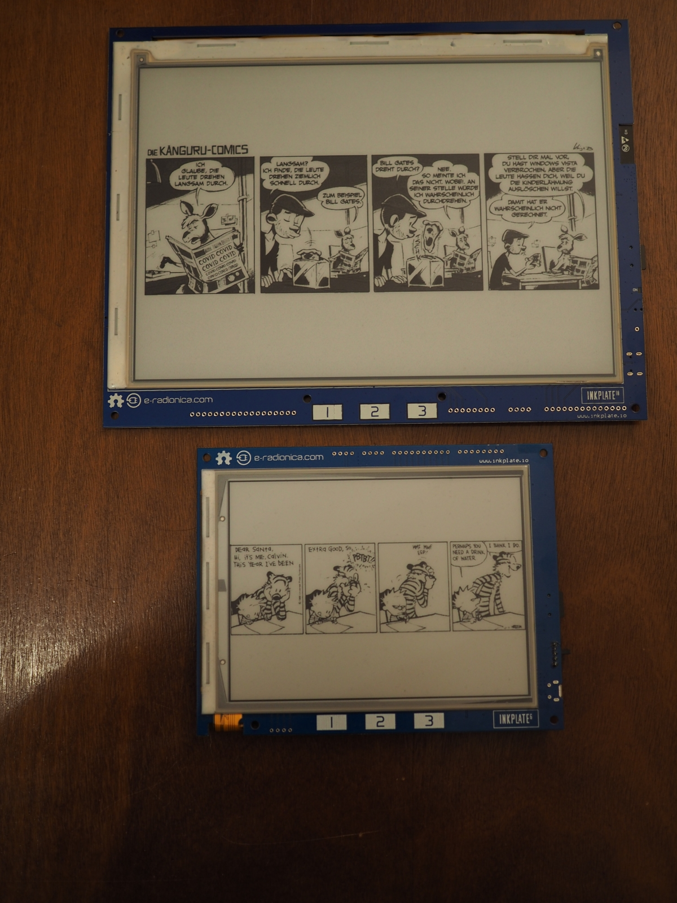

# Inkplate Dashboard

Turn your Inkplate into a viewer for comic strips and (motivational?) messages!

Inkplate Dashboard lets you define multiple views that you can flip through using the middle touch button on your Inkplate.

At the moment there are two views: one that lets you browse through images from the microSD card and another that displays a user-defined text.

You can have multiple instances of each module. What modules you want to have and what they should display is defined in a TOML file on the microSD card.




## Image/Comics Viewer

The comics module displays JPG/PNG images (caveat: see "Issues" section). The left and right buttons allow you to traverse a folder structure in alphanumerical order. I wrote this to chronologically read through comic strips, but it can of course be used for any kinds of images.

The viewer does not do any kind of on-the-fly resizing, you need to size the images to fit beforehand.

Something like this might do the trick (assuming your comics are in a `YEAR/MONTH/DAY.extension` folder structure):

```shell
comics_root="/path/to/some/folder"
for year in $(ls -1 ${comics_root}/); do
    if [ ! -d $year ]; then
        mkdir $year
    fi
    for month in $(ls -1 ${comics_root}/${year}/); do
        echo "$year: $month"
        if [ ! -d $year/$month ]; then
            mkdir $year/$month
        fi
        for file in $(ls -1 ${comics_root}/${year}/${month}/); do
            convert -resize 800x600 ${comics_root}/${year}/${month}/${file} ${year}/${month}/${file%.*}.png
        done
    done
done
```

(replace `800x600` with `1200x825` for Inkplate 10 or `1024x758` for Inkplate 6PLUS)


## Text Viewer

The text viewer shows a text. That is all it does. It is not pretty, it does not support formatting, but at least it wraps the text. It is really more meant as a code example, to give some orientation over how you would write your own view module.

The text module takes a `text` parameter, containing the text it should display.
Optionally you can also configure the font size with the `size` parameter.


## Example Config

The config file goes into the root folder of the SD card. It should be named `config.toml` and is a TOML file, as the name suggests. 

```toml
[general]
modules = [
    { module = "comics", path = "calvin" },
    { module = "text", text = "Hello! You look great today!", size = 12 },
    { module = "comics", path = "kaenguru" }
]
```


## Issues

* Image viewer: JPEGs don't work reliably, sometimes you get just an empty screen. Which is a shame, because when they work, they tend to display faster (see next point) than the same image as a PNG.
* Image viewer: Rendering large images can take an amount of time that makes you wonder if the button press was registered. Some kind of quick visual indicator that the Inkplate is busy would be nice.


## Ideas for modules and other improvements

* a weather forecast module
* a calendar module that get's the day's/week's tasks from CalDAV
* make it usable on the Inkplate 6PLUS. It runs on the 6PLUS, but since there are no dedicated touch buttons, it is kind of pointless.


## Thanks

I would like to thank:
* e-radionica for making the Inkplate.
* CK Tan for [tomlc99](https://github.com/cktan/tomlc99)
